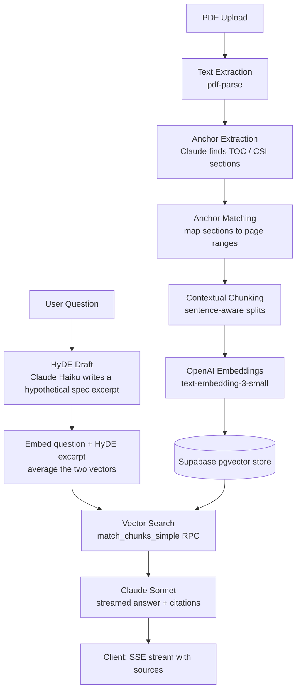

# precon-ai
> RAG-based AI assistant for construction pre-construction workflows

## What It Does
PreCon AI helps estimators and pre-construction teams at heavy civil general contractors get instant, cited answers from massive government spec books instead of manually searching hundreds of pages.

Two modules are built and working today:

- **Document Ingestion** — Upload a spec book PDF, extract text page-by-page, use Claude to locate the Table of Contents and identify CSI division/section anchors, match those anchors back to page ranges, and chunk the text contextually (sentence-aware, not fixed-size) before embedding.
- **AI Q&A** — Ask a question in natural language and get an answer grounded strictly in the uploaded specifications, with inline page citations (e.g. `[Page 45]`). Uses HyDE (Hypothetical Document Embeddings) to bridge the gap between how people ask questions and how spec books are actually written, then streams the answer token-by-token.

Additional modules (RFI generation, bid leveling, quote registry) are in development.

## The Problem It Solves
Manual pre-construction workflows at NYC general contractors involve drafting trade scopes, writing RFIs, leveling subcontractor quotes, and navigating hundreds of pages of agency specifications (DDC, DEP, DOT, SCA). This tool automates the document-heavy parts of that process using a retrieval-augmented generation pipeline built on project-specific documents.

## Architecture



## Tech Stack
- **Framework:** Next.js 16.2 (App Router), React 19.2, TypeScript
- **UI:** ShadCN UI + Tailwind CSS 4, Radix primitives, Lucide icons
- **Database:** Supabase (PostgreSQL + pgvector), Row Level Security on every table by `org_id`
- **Auth & Storage:** Supabase Auth, Supabase Storage
- **LLMs:** Anthropic Claude (Haiku for HyDE, Sonnet for Q&A), OpenAI (`text-embedding-3-small`)
- **PDF processing:** `pdf-parse`
- **Validation:** Zod
- **Deployment:** Vercel

## Setup

1. Clone the repo and install dependencies:
   ```bash
   npm install
   ```
2. Copy `.env.example` to `.env.local` and fill in:
   - `NEXT_PUBLIC_SUPABASE_URL`
   - `NEXT_PUBLIC_SUPABASE_ANON_KEY`
   - `SUPABASE_SERVICE_ROLE_KEY`
   - `OPENAI_API_KEY`
   - `ANTHROPIC_API_KEY`
3. Run the Supabase migration in `migrations/m2_match_chunks_simple.sql` against your project (creates the `match_chunks_simple` vector search RPC).
4. Start the dev server:
   ```bash
   npm run dev
   ```
5. Open `http://localhost:3000`.

## Usage Examples
Screenshots and sample outputs coming soon.

## Notes
Built and actively used for pre-construction workflows at a NYC general contractor bidding $350M+ in public infrastructure annually. Not intended for public deployment.
